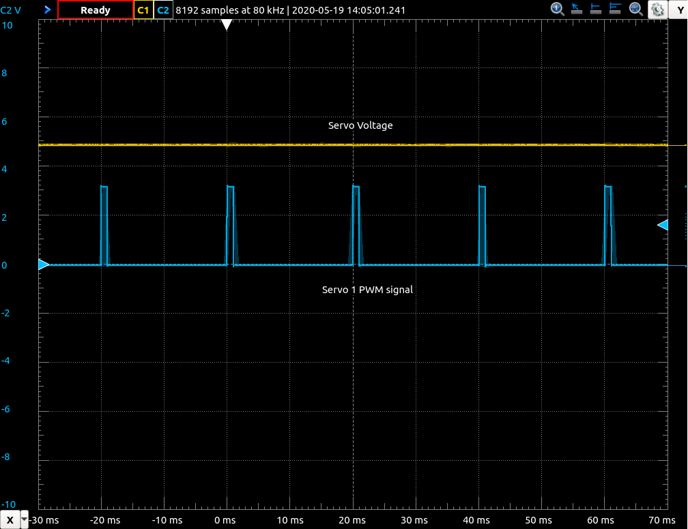

# rosbot-stm32-firmware
Embedded, low-level firmware for STM32 microcontroller inside ROSbot. Developed using [Mbed Os](https://os.mbed.com/mbed-os/).

```
______  _____  _____  _             _           __           
| ___ \|  _  |/  ___|| |           | |         / _|          
| |_/ /| | | |\ `--. | |__    ___  | |_       | |_ __      __
|    / | | | | `--. \| '_ \  / _ \ | __|      |  _|\ \ /\ / /
| |\ \ \ \_/ //\__/ /| |_) || (_) || |_       | |   \ V  V / 
\_| \_| \___/ \____/ |_.__/  \___/  \__|      |_|    \_/\_/  
```                                                    
**Firmware version:** `0.16.2`

## Prerequisites
You need to install following tools:
* [Visual Studio Code IDE](https://code.visualstudio.com/)

### Required Visual Studio Code extensions
* [Microsoft C/C++ extension](https://marketplace.visualstudio.com/items?itemName=ms-vscode.cpptools) (`ms-vscode.cpptools`)
* [PlatformIO IDE](https://marketplace.visualstudio.com/items?itemName=platformio.platformio-ide) (`platformio.platformio-ide`)

## Speed up build process
https://docs.platformio.org/en/latest/frameworks/mbed.html#ignoring-particular-components

In directory `~/.platformio/packages/framework-mbed/features` create file called `.mbedignore` with the following content:

```
cellular/*
cryptocell/*
deprecated_warnings/*
lorawan/*
lwipstack/*
nanostack/*
netsocket/*
nfc/*
unsupported/*
```

## Build for ROS Melodic/Kinetic
By default the ROSbot firmware supports **ROS Noetic**. To build it for previous ROS distributions **remove** below flag from `platformio.ini`:
```
-D ROS_NOETIC_MSGS=1
```

## Build firmware
Use `PlatformIO: Build` task.

## Uploading firmware

### Uploading firmware using ST-Link
Use `PlatformIO: Upload` task.

### Uploading firmware using `core2-flasher`
> TODO: add core2-flasher to repository (download right version by detecting system type), use advance scripting: https://docs.platformio.org/en/latest/projectconf/advanced_scripting.html

<!-- Edit project's `mbed_app.json` file and change `"target.OUTPUT_EXT": "bin"` line to `"target.OUTPUT_EXT": "hex"`. Build your project. -->
To create intel hex file use `arm-none-eabi-objcopy`: 
```bash
$ arm-none-eabi-objcopy -O ihex firmware.elf firmware.hex 
```
You will find `firmware.elf` in `./pio/core2`.


To flash firmware using `core2-flasher` run:
```
core2-flasher firmware.hex
```

### Uploading firmware using `stm32loader`
https://github.com/husarion/stm32loader

This tool allows you to upload firmware using RPi connector.

If you have the bootloader the first two sectors are write protected. Before uploading new firmware you must unlock them (this will erase the bootloader):

```bash
$ sudo stm32loader -c <your_sbc> -u -W
```

To upload new firmware run:
```bash
$ sudo stm32loader -c <your_sbc> -e -v -w firmware.bin
```

where `<your_sbc>` :
* `tinker` for Asus Tinker Board
* `upboard` for Upboard
* `rpi` for Raspberry Pi

You will find `firmware.bin` in `./pio/core2`.

## rosserial interface

To use this firmware you have to disable communication with Husarion Cloud. On your SBC run:

```bash
$ sudo systemctl disable husarnet-configurator
$ sudo reboot
```

To start rosserial communication run:

```bash
$ rosrun rosserial_node serial_node.py.py _port:=<SBC_port_name> _baud:=<port_baudrate>
```

`<SBC_port_name>`:
- `/dev/ttyS1` for Asus Tinker Board,
- `/dev/serial0` for Raspberry Pi
- `/dev/ttyS4` for UpBoard

`<port_baudrate>`:
- `525000` for UpBoard
- `525000` for Asus Tinker Board
- `525000` for Raspberry Pi

The baudrate should be adjusted for SBC you use. The default value for this firmware is `525000`.

<!-- You can build firmware for the another baudrate changing only one line in `mbed_app.json`:

```json
"rosserial-mbed.baudrate": 460800,
``` -->

The following `rosserial.launch` file can be used to start `roscore` and `rosserial_python` communication:

```xml
<launch>
  <arg name="serial_port" default="/dev/ttyUSB0"/>
  <arg name="serial_baudrate" default="525000"/>
  <node pkg="rosserial_python" type="serial_node.py" name="serial_node" output="screen">
    <param name="port" value="$(arg serial_port)"/>
    <param name="baud" value="$(arg serial_baudrate)"/>
  </node>
</launch>
```

Usage for Asus Tinker Board:

```bash
$ roslaunch rosserial.launch serial_port:=/dev/ttyS1 serial_baudrate:=525000
```

## ROS communication

ROSbot subscribes to:

* `/cmd_vel` with message type `geometry_msgs/Twist`
* `/cmd_ser` with message type `std_msgs/UInt32` - control configured servo output. See `CSER` service command to learn how to configure servo outputs. Message format:

    ```plain
    MSB [ duty_cycle_us | output_id] LSB
            28bits           4bits
    ```
    Servos are numbered from 1 to 6, where 1 means hServo 1 output etc. To set SERVO 1 duty cycle to 1000us (0x3E8) run:
    ```plain
    $ rostopic pub /cmd_ser std_msgs/UInt32 "data: 0x3E81" --once 
    ``` 

ROSbot publishes to:

* `/velocity` with message type `geometry_msgs/Twist`
* `/battery` with message type `sensor_msgs/BatteryState`
* `/pose` with message type `geometry_msgs/Pose`
* `/range/fl` with message type `sensor_msgs/Range`
* `/range/fr` with message type `sensor_msgs/Range`
* `/range/rl` with message type `sensor_msgs/Range`
* `/range/rr` with message type `sensor_msgs/Range`
* `/joint_states` with message type `sensor_msgs/JointState`
* `/mpu9250` with custom message type `rosbot_ekf/Imu`
* `/buttons` with message type `std_msgs/UInt8`

ROSbot provides service server:
* `/config` with custom message type `rosbot_ekf/Configuration` 

```bash
$ rossrv show rosbot_ekf/Configuration 
string command
string data
---
uint8 SUCCESS=0
uint8 FAILURE=1
uint8 COMMAND_NOT_FOUND=2
string data
uint8 result
```

At the moment following commands are available:
* `CSER` - CONFIGURE SERVO

    Change a configuration of servo outputs. Can be repeated as many times as required to change several configuration parameter at once. The parameter name should be separated from the value with a full column `:` character. Available parameters:
    * `S` - select servo output, required with `P` and `W` options [`1`:`6`]
    * `V` - select voltage mode:
        * `0` - about 5V
        * `1` - about 6V
        * `2` - about 7.4V
        * `3` - about 8.6V
    * `E` - enable servo output [`1`,`0`]
    * `P` - set period in us
    * `W` - set duty cycle in us

    To set servo voltages to 5V and enable `SERVO 1` output with period 20ms and width 1ms run:
    ```bash
    $ rosservice call /config "command: 'CSER'
    >data: 'V:0 S:1 E:1 P:20000 W:1000 '"
    ```

     

* `CPID` - CONFIGURE PID

    Change the motor's pid configuration. This command is similar to CSER command. You can change multiple parameters at the same time.
    Available parameters:
    * `kp` - proportional gain (default: 0.8)
    * `ki` - integral gain (default: 0.2)
    * `kd` - derivative gain (default: 0.015)
    * `out_max` - upper limit of the pid output, represents pwm duty cycle (default: 0.80, max: 0.80)
    * `out_min` - lower limit of the pid output, represents pwm duty cycle when motor spins in opposite direction (default: -0.80, min: -0.80)
    * `a_max` - acceleration limit (default: 1.5e-4 m/s2)
    * `speed_max` - max motor speed (default: 1.0 m/s, max: 1.25 m/s)

    To limit pid outputs to 75% run: 
    ```bash
    $ rosservice call /config "command: 'CPID'
    >data: 'out_max:0.75 out_min:-0.75'"
    ```
    
* `GPID` - GET PID CONFIGURATION

    To get current PID configuration run:
    ```bash
    $ rosservice call /config "command: 'GPID'
    data: ''" 
    ```
    Response:
    ```bash
    data: "kp:0.800 ki:0.200 kd:0.015 out_max:1.000 out_min:-1.000 a_max:1. 500e-04 speed_max:\
      \ 1.500"
    result: 0

    ```

* `SLED` - SET LED:

    To set LED2 on run:
    ```bash
    $ rosservice call /config "command: 'SLED'
    >data: '2 1'" 
    ```
*  `EIMU` - ENABLE/DISABLE IMU:

    To enable IMU MPU9250 run:
    ```bash
    $ rosservice call /config "command: 'EIMU'
    >data: '1'" 
    ```
    * `data: '1'` - enable
    * `data: '0'` - disable

* `RIMU` - RESET IMU (for Kalman related odometry)

    To reset IMU MPU9250 run:
    ```bash
    $ rosservice call /config "command: 'RIMU'
    >data: ''"
    ``` 

<!-- * `EDSE` - ENABLE/DISABLE DISTANCE SENSORS:
    
    To enable VL53LX0 distance sensors run:
    ```bash
    $ rosservice call /config "command: 'EDSE'
    >data: '1'" 
    ```
    * `data: '1'` - enable
    * `data: '0'` - disable -->
    
* `EJSM` -  ENABLE/DISABLE JOINT STATES MESSAGES

    To enable JointStates messages run:
    ```bash
    $ rosservice call /config "command: `EJSM`
    >data: '1'"
    ```
    * `data: '1'` - enable
    * `data: '0'` - disable

* `RODOM` - RESET ODOMETRY

    To reset odometry run:
    ```bash
    $ rosservice call /config "command: `RODOM`
    >data: ''"
    
* `CALI` - ODOMETRY CALIBRATION (update coefficients)

    To update `diameter_modificator` and `tyre_deflation` run:
    ```bash
    $ rosservice call /config "command: `CALI`
    >data: 'X Y'"
    ```
    * `X` - `diameter_modificator` value
    * `Y` - `tyre_deflation` value

* `EMOT` - ENABLE/DISABLE MOTORS

    To disable motors run:
    ```bash
    $ rosservice call /config "command 'EMOT'
    >data '0'
    ```
    * `0` - disconnect motors
    * `1` - connect motors

* `SANI` - SET WS2812B LEDS ANIMATION

    To enable the ws2812b interface open the `mbed_app.json` file and change the line:

    ```json
    "enable-ws2812b-signalization": 0
    ```
    to
    ```json
    "enable-ws2812b-signalization": 1
    ```

    To set fading blue animation run:
    ```bash
    $ rosservice call /config "command: `SANI`
    >data: 'F #0000aa'"
    ```
    
    Available commands:
    * `O` - OFF
    * `S <hex color code>` - SOLID COLOR 
    * `F <hex color code>` - FADE IN FADE OUT ANIMATION
    * `B <hex color code>` - BLINK FRONT/REAR ANIMATION
    * `R` - RAINBOW ANIMATION

* `SKIN` - SET ROSBOT KINEMATICS DIFFERENTIAL/MECANUM 

    By default robot always start with differential drive kinematics available to change by command
    ```bash
    $ rosservice call /config "command 'SKIN'
    >data 'DIFF'
    ```
    
    To set mecanum kinematics run 
    
    ```bash
    $ rosservice call /config "command 'SKIN'
    >data 'MEC'
    ```
    * `MEC` - mecanum kinematics
    * `DIFF` - differential drive kinematics 


### ROS requirements - `rosbot_ekf` package
> TODO: change rosbot_ekf lib

In order to use the service you have to download the package `rosbot_ekf` that can be found [HERE](https://github.com/husarion/rosbot_ekf). For installation details check the [README](https://github.com/husarion/rosbot_ekf/blob/master/README.md). 

The package incorporate a ready to use **Extended Kalman Filter** that combines both the imu and encoders measurements to better approximate the ROSbot position and orientation. The package also contains custom messages that are required by the new firmware.

To launch the rosserial communication and Kalman filter run:
```bash
$ roslaunch rosbot_ekf all.launch
```

For PRO version add parameter:

```bash
$ roslaunch rosbot_ekf all.launch rosbot_pro:=true
```

## Versioning

The project uses [SemVer](http://semver.org/) for versioning. For the versions available, see the [tags on this repository](https://github.com/husarion/rosbot-firmware-new/tags). 

## Changelog

See [CHANGELOG.md](CHANGELOG.md).

## Starting with Mbed OS

Documentation:
* [MBED OS Documentation](https://os.mbed.com/docs/v5.14/)
* [MBED OS API Doxygen](https://os.mbed.com/docs/v5.14/mbed-os-api-doxy/modules.html)

## Important dev links (mbed + platformio)
* https://github.com/platformio/platform-ststm32/tree/develop/examples/mbed-legacy-examples/mbed-rtos
* https://github.com/platformio/platform-ststm32/blob/develop/boards/olimex_e407.json
* https://github.com/platformio/platform-ststm32/blob/develop/boards/black_f407zg.json
* https://github.com/ARMmbed/mbed-os/tree/mbed-os-5.15.6/targets/TARGET_STM/TARGET_STM32F4/TARGET_STM32F407xG
* https://docs.platformio.org/en/latest/frameworks/mbed.html
* https://docs.platformio.org/en/latest/platforms/creating_board.html

## Python 3.10.x trooubleshoot
* https://stackoverflow.com/questions/72032032/importerror-cannot-import-name-iterable-from-collections-in-python

Required changes in pio files:
`File ".platformio/packages/framework-mbed/platformio/package_deps/py3/past/types/oldstr.py", line 5:`
```diff
> from collections.abc import Iterable
< from collections import Iterable
```
`File ".platformio/packages/framework-mbed/platformio/package_deps/py3/past/builtins/misc.py", line 4:`
```diff
> from collections.abc import Mapping
< from collections import Mapping
```